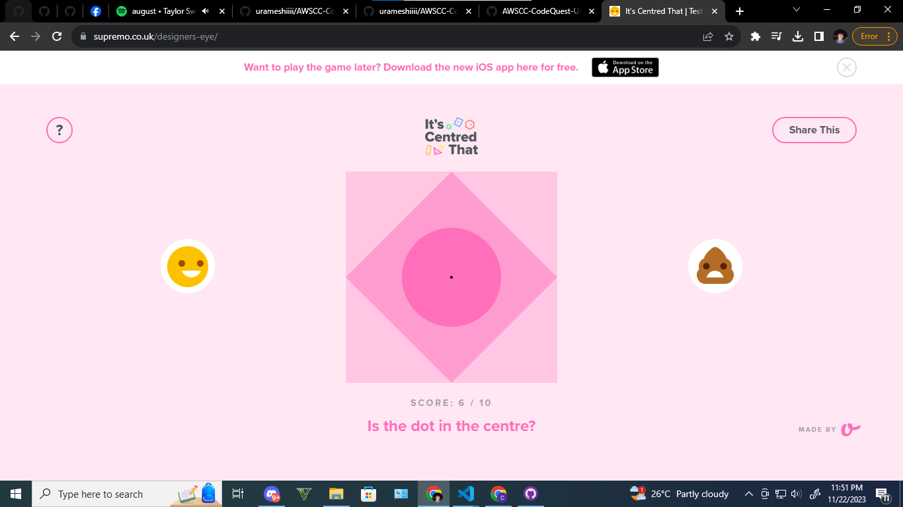

## Hello there, my fellow Alfbuddy! 💖

You've made it—great job! Now, here's the scoop: this markdown file is your **canvas**. Customize it; let your creativity flow!

Remember, you're free to add your personal touch, but keep the sacred requirements intact; they are the guardians of order here. This markdown file should or may include:

#### 1. UI and UX analyses for Day 1

_(just choose the questions you would like to answer and make it concise)_
  
&nbsp;&nbsp;&nbsp;&nbsp;**User-Experience Analysis:** 

-   Which website is easier to find the product you are looking for? 
    Answer:
    I think Lazada, because when you browse the website of Lazada it will show you all of its category. From Electronic Device to Automotives and Motorcycle.
-   Identify any distractions or unnecessary elements that could potentially confuse users. 
    Answer: For me, i find the win gadget game wheel in shopee distractive. Specially in the mobile application, we can click those elements while we are scrolling. 

-   Compare the organization of content between the two platforms. Which between the two platforms’ content is easier to scan and understand? 
    Answer: I think that Shopee is more organized. I find it easier to scan and understand. Maybe because I am more familiar with Shopee because I rarely checkout orders in Lazada. 

  &nbsp;&nbsp;&nbsp;&nbsp;**User-Interface Analysis:**

-   Is the websites’ layout and design visually pleasing and consistent with their brand? 
    Answer: Yes, both website are visually pleasing and consistent. I still remember when I am browsing those two websites a few years ago, I can definitely say that there are improvements in terms of design and they are consistent with their brand.
    
-   Comment on the responsiveness of both websites across different devices. 
    Answer:
    
-   Which do you think is better when it comes to the visual aspect of the website? 
    Answer:I think that Shopee is better than Lazada in terms of visual aspect of the website. I prefer more the design of Shopee because of its color compare to Lazada. 
     

#### 2. An **optional** screenshot of playing the game **"It's Centred That"** and your feedback

 Ready to include your output for **Day 1**? Let the customization begin! 🚀✨

<!-- You may now delete and modify the content of this file -->
